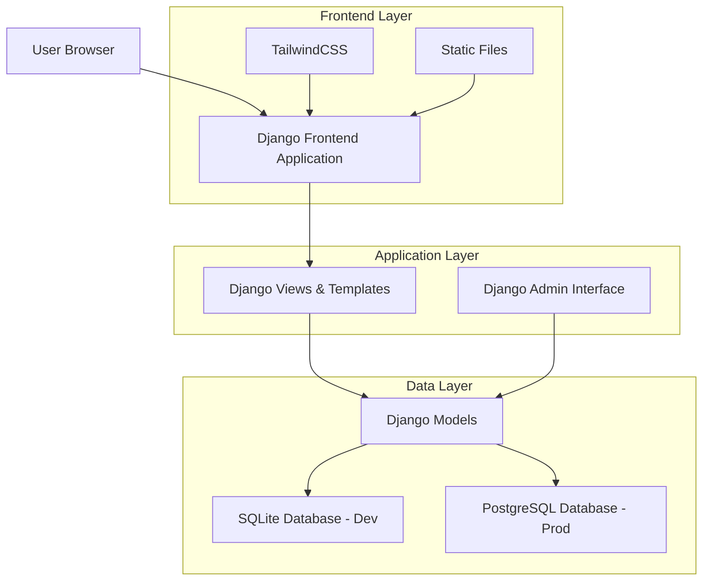
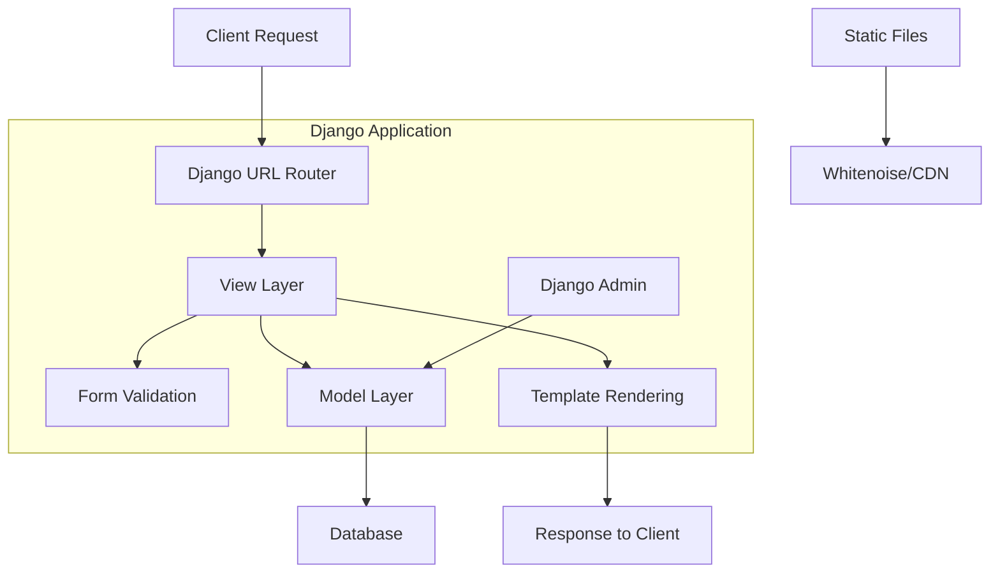
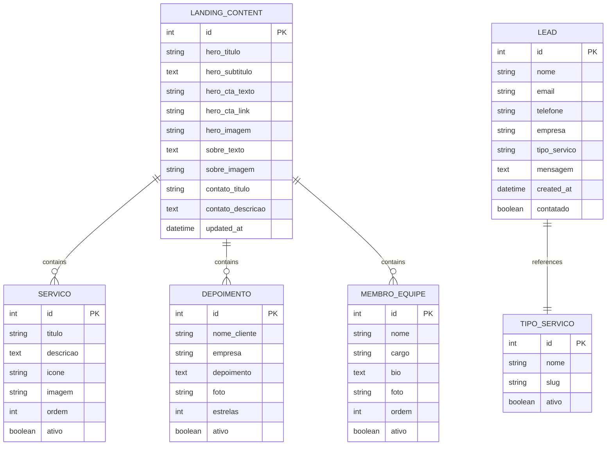

# Clima Ar Ne Refrigeração: Arquitetura Técnica da Landing Page

## 1. Architecture Design



## 2. Technology Description

- **Frontend**: Django Templates + TailwindCSS 3.x + Alpine.js (mínimo)
- **Backend**: Django 5.x + Python 3.12+
- **Database**: SQLite (desenvolvimento) / PostgreSQL (produção)
- **Styling**: TailwindCSS integrado via Django-Tailwind
- **Forms**: Django Forms com validação customizada
- **Email**: Django Email Backend + SMTP configurável

## 3. Route Definitions

| Route | Purpose |
|-------|---------|
| / | Landing page principal com todas as seções |
| /admin/ | Interface administrativa Django para gerenciar conteúdo |
| /contato/ | Endpoint para processamento do formulário (POST) |
| /static/ | Arquivos estáticos (CSS, JS, imagens) |
| /media/ | Upload de imagens editáveis pelo admin |

## 4. API Definitions

### 4.1 Core API

**Formulário de Contato**
```
POST /contato/
```

Request:
| Param Name | Param Type | isRequired | Description |
|------------|------------|------------|-------------|
| nome | string | true | Nome completo do cliente |
| email | string | true | Email válido para contato |
| telefone | string | true | Telefone com DDD |
| empresa | string | false | Nome da empresa |
| tipo_servico | string | true | Tipo de serviço solicitado |
| mensagem | text | true | Descrição detalhada da necessidade |

Response:
| Param Name | Param Type | Description |
|------------|------------|-------------|
| success | boolean | Status do envio |
| message | string | Mensagem de confirmação |

Example:
```json
{
  "nome": "João Silva",
  "email": "joao@empresa.com",
  "telefone": "(11) 99999-9999",
  "empresa": "Supermercado ABC",
  "tipo_servico": "manutencao",
  "mensagem": "Preciso de manutenção preventiva em câmaras frias"
}
```

## 5. Server Architecture Diagram



## 6. Data Model

### 6.1 Data Model Definition



### 6.2 Data Definition Language

**Landing Content Table (landing_content)**
```sql
-- Tabela principal para conteúdo editável
CREATE TABLE landing_content (
    id SERIAL PRIMARY KEY,
    hero_titulo VARCHAR(200) NOT NULL DEFAULT 'Soluções Profissionais em Refrigeração',
    hero_subtitulo TEXT DEFAULT 'Especialistas em instalação, manutenção e reparo de sistemas de refrigeração comercial e industrial',
    hero_cta_texto VARCHAR(50) DEFAULT 'Solicitar Orçamento',
    hero_cta_link VARCHAR(200) DEFAULT '#contato',
    hero_imagem VARCHAR(500) DEFAULT 'hero-bg.jpg',
    sobre_titulo VARCHAR(200) DEFAULT 'Sobre a Clima Ar Ne Refrigeração',
    sobre_texto TEXT DEFAULT 'Com mais de 10 anos de experiência...',
    sobre_imagem VARCHAR(500) DEFAULT 'sobre-nos.jpg',
    contato_titulo VARCHAR(200) DEFAULT 'Fale Conosco',
    contato_descricao TEXT DEFAULT 'Entre em contato para um orçamento personalizado',
    updated_at TIMESTAMP DEFAULT CURRENT_TIMESTAMP
);

-- Tabela de serviços
CREATE TABLE servicos (
    id SERIAL PRIMARY KEY,
    titulo VARCHAR(200) NOT NULL,
    descricao TEXT NOT NULL,
    icone VARCHAR(100) DEFAULT 'default-icon.svg',
    imagem VARCHAR(500),
    ordem INTEGER DEFAULT 0,
    ativo BOOLEAN DEFAULT TRUE,
    created_at TIMESTAMP DEFAULT CURRENT_TIMESTAMP
);

-- Tabela de depoimentos
CREATE TABLE depoimentos (
    id SERIAL PRIMARY KEY,
    nome_cliente VARCHAR(200) NOT NULL,
    empresa VARCHAR(200),
    depoimento TEXT NOT NULL,
    foto VARCHAR(500),
    estrelas INTEGER DEFAULT 5 CHECK (estrelas >= 1 AND estrelas <= 5),
    ativo BOOLEAN DEFAULT TRUE,
    created_at TIMESTAMP DEFAULT CURRENT_TIMESTAMP
);

-- Tabela de membros da equipe
CREATE TABLE membros_equipe (
    id SERIAL PRIMARY KEY,
    nome VARCHAR(200) NOT NULL,
    cargo VARCHAR(200) NOT NULL,
    bio TEXT,
    foto VARCHAR(500),
    ordem INTEGER DEFAULT 0,
    ativo BOOLEAN DEFAULT TRUE,
    created_at TIMESTAMP DEFAULT CURRENT_TIMESTAMP
);

-- Tabela de tipos de serviço
CREATE TABLE tipos_servico (
    id SERIAL PRIMARY KEY,
    nome VARCHAR(200) NOT NULL,
    slug VARCHAR(100) UNIQUE NOT NULL,
    ativo BOOLEAN DEFAULT TRUE
);

-- Tabela de leads
CREATE TABLE leads (
    id SERIAL PRIMARY KEY,
    nome VARCHAR(200) NOT NULL,
    email VARCHAR(254) NOT NULL,
    telefone VARCHAR(20) NOT NULL,
    empresa VARCHAR(200),
    tipo_servico VARCHAR(100) REFERENCES tipos_servico(slug),
    mensagem TEXT NOT NULL,
    created_at TIMESTAMP DEFAULT CURRENT_TIMESTAMP,
    contatado BOOLEAN DEFAULT FALSE,
    observacoes TEXT
);

-- Índices para performance
CREATE INDEX idx_leads_created_at ON leads(created_at DESC);
CREATE INDEX idx_leads_contatado ON leads(contatado);
CREATE INDEX idx_servicos_ordem ON servicos(ordem);
CREATE INDEX idx_servicos_ativo ON servicos(ativo);

-- Dados iniciais
INSERT INTO landing_content (id) VALUES (1);

INSERT INTO tipos_servico (nome, slug) VALUES 
('Instalação', 'instalacao'),
('Manutenção Preventiva', 'manutencao-preventiva'),
('Manutenção Corretiva', 'manutencao-corretiva'),
('Reparo de Emergência', 'reparo-emergencia'),
('Consultoria Técnica', 'consultoria');

INSERT INTO servicos (titulo, descricao, ordem, ativo) VALUES 
('Instalação de Sistemas', 'Instalação completa de sistemas de refrigeração comercial e industrial', 1, TRUE),
('Manutenção Preventiva', 'Manutenção programada para evitar falhas e prolongar vida útil', 2, TRUE),
('Reparo e Emergência', 'Atendimento 24h para reparos urgentes e emergências', 3, TRUE),
('Consultoria Especializada', 'Consultoria técnica para otimização de sistemas existentes', 4, TRUE);
```

## 7. Django Models Structure

### 7.1 Models.py Implementation

```python
# apps/landing/models.py
from django.db import models
from django.core.validators import MinValueValidator, MaxValueValidator
from django.utils.text import slugify

class LandingContent(models.Model):
    """Modelo singleton para conteúdo editável da landing page"""
    
    # Seção Hero
    hero_titulo = models.CharField(
        max_length=200, 
        default='Soluções Profissionais em Refrigeração',
        help_text='Título principal da seção hero'
    )
    hero_subtitulo = models.TextField(
        default='Especialistas em instalação, manutenção e reparo de sistemas de refrigeração comercial e industrial',
        help_text='Subtítulo explicativo da seção hero'
    )
    hero_cta_texto = models.CharField(
        max_length=50, 
        default='Solicitar Orçamento',
        help_text='Texto do botão principal'
    )
    hero_cta_link = models.CharField(
        max_length=200, 
        default='#contato',
        help_text='Link do botão principal'
    )
    hero_imagem = models.ImageField(
        upload_to='hero/', 
        blank=True, 
        null=True,
        help_text='Imagem de fundo da seção hero'
    )
    
    # Seção Sobre
    sobre_titulo = models.CharField(
        max_length=200, 
        default='Sobre a Clima Ar Ne Refrigeração',
        help_text='Título da seção sobre'
    )
    sobre_texto = models.TextField(
        default='Com mais de 10 anos de experiência no mercado de refrigeração...',
        help_text='Texto principal da seção sobre'
    )
    sobre_imagem = models.ImageField(
        upload_to='sobre/', 
        blank=True, 
        null=True,
        help_text='Imagem da seção sobre'
    )
    
    # Seção Contato
    contato_titulo = models.CharField(
        max_length=200, 
        default='Fale Conosco',
        help_text='Título da seção contato'
    )
    contato_descricao = models.TextField(
        default='Entre em contato para um orçamento personalizado',
        help_text='Descrição da seção contato'
    )
    
    updated_at = models.DateTimeField(auto_now=True)
    
    class Meta:
        verbose_name = 'Conteúdo da Landing Page'
        verbose_name_plural = 'Conteúdo da Landing Page'
    
    def save(self, *args, **kwargs):
        self.pk = 1  # Força singleton
        super().save(*args, **kwargs)
    
    def __str__(self):
        return 'Conteúdo da Landing Page'

class TipoServico(models.Model):
    nome = models.CharField(max_length=200)
    slug = models.SlugField(unique=True, blank=True)
    ativo = models.BooleanField(default=True)
    
    class Meta:
        verbose_name = 'Tipo de Serviço'
        verbose_name_plural = 'Tipos de Serviço'
    
    def save(self, *args, **kwargs):
        if not self.slug:
            self.slug = slugify(self.nome)
        super().save(*args, **kwargs)
    
    def __str__(self):
        return self.nome

class Servico(models.Model):
    titulo = models.CharField(max_length=200)
    descricao = models.TextField()
    icone = models.CharField(
        max_length=100, 
        default='default-icon.svg',
        help_text='Nome do arquivo do ícone SVG'
    )
    imagem = models.ImageField(upload_to='servicos/', blank=True, null=True)
    ordem = models.PositiveIntegerField(default=0)
    ativo = models.BooleanField(default=True)
    created_at = models.DateTimeField(auto_now_add=True)
    
    class Meta:
        verbose_name = 'Serviço'
        verbose_name_plural = 'Serviços'
        ordering = ['ordem', 'titulo']
    
    def __str__(self):
        return self.titulo

class Lead(models.Model):
    nome = models.CharField(max_length=200)
    email = models.EmailField()
    telefone = models.CharField(max_length=20)
    empresa = models.CharField(max_length=200, blank=True)
    tipo_servico = models.ForeignKey(
        TipoServico, 
        on_delete=models.SET_NULL, 
        null=True,
        blank=True
    )
    mensagem = models.TextField()
    created_at = models.DateTimeField(auto_now_add=True)
    contatado = models.BooleanField(default=False)
    observacoes = models.TextField(blank=True)
    
    class Meta:
        verbose_name = 'Lead'
        verbose_name_plural = 'Leads'
        ordering = ['-created_at']
    
    def __str__(self):
        return f'{self.nome} - {self.email}'
```

## 8. Django Admin Configuration

### 8.1 Admin.py Implementation

```python
# apps/landing/admin.py
from django.contrib import admin
from django.utils.html import format_html
from .models import LandingContent, Servico, Lead, TipoServico

@admin.register(LandingContent)
class LandingContentAdmin(admin.ModelAdmin):
    fieldsets = (
        ('Seção Hero', {
            'fields': ('hero_titulo', 'hero_subtitulo', 'hero_cta_texto', 'hero_cta_link', 'hero_imagem')
        }),
        ('Seção Sobre', {
            'fields': ('sobre_titulo', 'sobre_texto', 'sobre_imagem')
        }),
        ('Seção Contato', {
            'fields': ('contato_titulo', 'contato_descricao')
        }),
    )
    
    def has_add_permission(self, request):
        return not LandingContent.objects.exists()
    
    def has_delete_permission(self, request, obj=None):
        return False

@admin.register(Servico)
class ServicoAdmin(admin.ModelAdmin):
    list_display = ('titulo', 'ordem', 'ativo', 'created_at')
    list_filter = ('ativo', 'created_at')
    search_fields = ('titulo', 'descricao')
    list_editable = ('ordem', 'ativo')
    ordering = ('ordem',)

@admin.register(Lead)
class LeadAdmin(admin.ModelAdmin):
    list_display = ('nome', 'email', 'empresa', 'tipo_servico', 'created_at', 'contatado')
    list_filter = ('contatado', 'tipo_servico', 'created_at')
    search_fields = ('nome', 'email', 'empresa')
    list_editable = ('contatado',)
    readonly_fields = ('created_at',)
    date_hierarchy = 'created_at'
    
    fieldsets = (
        ('Informações do Lead', {
            'fields': ('nome', 'email', 'telefone', 'empresa')
        }),
        ('Solicitação', {
            'fields': ('tipo_servico', 'mensagem')
        }),
        ('Gestão', {
            'fields': ('contatado', 'observacoes', 'created_at')
        }),
    )

@admin.register(TipoServico)
class TipoServicoAdmin(admin.ModelAdmin):
    list_display = ('nome', 'slug', 'ativo')
    list_filter = ('ativo',)
    search_fields = ('nome',)
    prepopulated_fields = {'slug': ('nome',)}
```

## 9. Performance and SEO Optimization

### 9.1 Django Settings Configuration

```python
# Configurações de performance e SEO
INSTALLED_APPS = [
    'django.contrib.admin',
    'django.contrib.auth',
    'django.contrib.contenttypes',
    'django.contrib.sessions',
    'django.contrib.messages',
    'django.contrib.staticfiles',
    'django.contrib.sitemaps',  # Para SEO
    'tailwind',  # Django-tailwind
    'apps.landing',
]

# Configurações de mídia para uploads
MEDIA_URL = '/media/'
MEDIA_ROOT = BASE_DIR / 'media'

# Configurações de cache para performance
CACHES = {
    'default': {
        'BACKEND': 'django.core.cache.backends.locmem.LocMemCache',
    }
}

# Configurações de email
EMAIL_BACKEND = 'django.core.mail.backends.smtp.EmailBackend'
EMAIL_HOST = 'smtp.gmail.com'
EMAIL_PORT = 587
EMAIL_USE_TLS = True
EMAIL_HOST_USER = 'your-email@gmail.com'
EMAIL_HOST_PASSWORD = 'your-app-password'
```

Esta arquitetura técnica fornece uma base sólida para implementar a landing page Clima Ar Ne Refrigeração com sistema completo de gerenciamento de conteúdo via Django admin, otimizada para performance, SEO e conversão de leads.