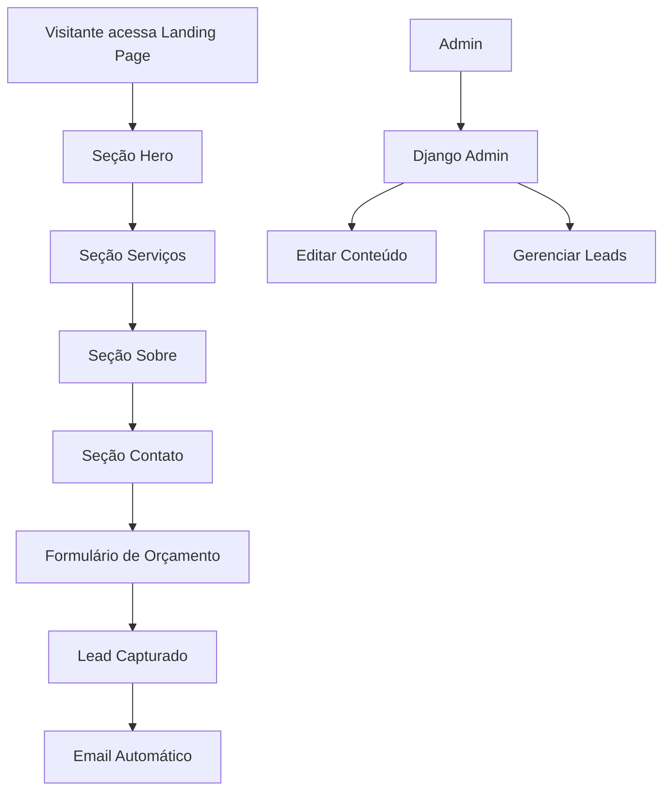

# Clima Ar Ne Refrigeração: Landing Page de Refrigeração Profissional - PRD

## 1. Product Overview

Clima Ar Ne Refrigeração é uma landing page otimizada para conversão que centraliza serviços de refrigeração comercial e industrial, conectando proprietários de negócios com profissionais especializados através de uma experiência digital intuitiva e eficiente.

A plataforma resolve o problema da fragmentação no mercado de refrigeração, onde empresas perdem tempo procurando serviços confiáveis, oferecendo uma solução centralizada que gera leads qualificados através de CTAs estratégicos e conteúdo persuasivo.

O objetivo é capturar 15% do mercado local de refrigeração em 12 meses, gerando pelo menos 50 leads qualificados mensais.

## 2. Core Features

### 2.1 User Roles

| Role | Registration Method | Core Permissions |
|------|---------------------|------------------|
| Visitante Anônimo | Acesso direto à landing page | Navegar por seções, visualizar conteúdo, enviar formulários |
| Administrador | Login Django admin | Gerenciar conteúdo, leads, configurações da página |

### 2.2 Feature Module

Nossa landing page consiste nas seguintes seções principais:

1. **Seção Hero**: banner principal, título impactante, subtítulo explicativo, CTA primário, imagem de fundo
2. **Seção Serviços**: cards de serviços, descrições detalhadas, ícones representativos, depoimentos
3. **Seção Sobre**: história da empresa, valores, equipe, certificações, galeria de projetos
4. **Seção Contato**: formulário de orçamento, informações de contato, mapa de localização, CTAs secundários

### 2.3 Page Details

| Page Name | Module Name | Feature description |
|-----------|-------------|---------------------|
| Landing Page | Seção Hero | Exibir título principal editável, subtítulo, CTA customizável, imagem de fundo substituível |
| Landing Page | Seção Serviços | Mostrar cards de serviços com títulos, descrições e ícones editáveis via admin |
| Landing Page | Seção Sobre | Apresentar texto sobre empresa, imagens da equipe e galeria editáveis |
| Landing Page | Seção Contato | Formulário de contato com validação, captura de leads, envio de emails |
| Django Admin | Gerenciamento de Conteúdo | Editar todos os textos, imagens, CTAs e configurações da landing page |
| Django Admin | Gerenciamento de Leads | Visualizar, filtrar, exportar leads capturados pelo formulário |

## 3. Core Process

**Fluxo do Visitante:**
1. Acesso à landing page única
2. Navegação por scroll ou âncoras: Hero → Serviços → Sobre → Contato
3. Interação com CTAs direcionando para formulário de contato
4. Preenchimento e envio do formulário
5. Confirmação de recebimento e follow-up automático

**Fluxo Administrativo:**
1. Login no Django admin
2. Edição de conteúdo das seções (textos, imagens, CTAs)
3. Gerenciamento de leads recebidos
4. Configuração de emails automáticos

## 4. User Interface Design

### 4.1 Design Style

- **Cores Primárias**: Azul Gelo (#00BFFF) para energia e frescor, Verde Energético (#32CD32) para CTAs
- **Cores Secundárias**: Cinza Metálico (#A9A9A9) para profissionalismo, Branco (#FFFFFF), Preto Suave (#333333)
- **Tipografia**: Montserrat Bold para cabeçalhos (H1: 48px, H2: 32px), Open Sans Regular para corpo (16px)
- **Estilo de Botões**: Rounded corners, hover effects, sombras suaves
- **Layout**: Single-page scroll com seções full-width, grid de 12 colunas
- **Ícones**: Estilo minimalista relacionados à refrigeração e tecnologia

### 4.2 Page Design Overview

| Page Name | Module Name | UI Elements |
|-----------|-------------|-------------|
| Landing Page | Seção Hero | Background image overlay, título centralizado, CTA button destacado, navegação fixa |
| Landing Page | Seção Serviços | Grid de cards responsivo, ícones SVG, hover effects, gradientes suaves |
| Landing Page | Seção Sobre | Layout duas colunas, galeria de imagens, timeline de história |
| Landing Page | Seção Contato | Formulário estilizado, validação visual, mapa integrado, informações de contato |

### 4.3 Responsividade

Design mobile-first com breakpoints em 640px (sm), 768px (md), 1024px (lg). Seções empilham verticalmente em dispositivos móveis, com otimização para touch e carregamento rápido.